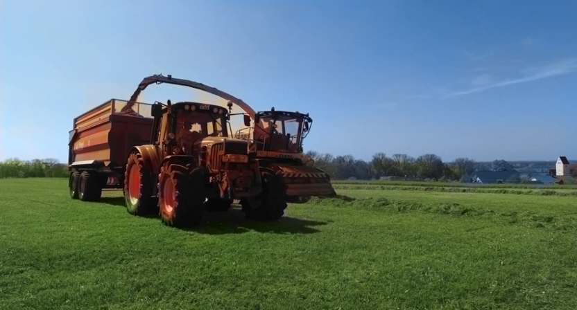
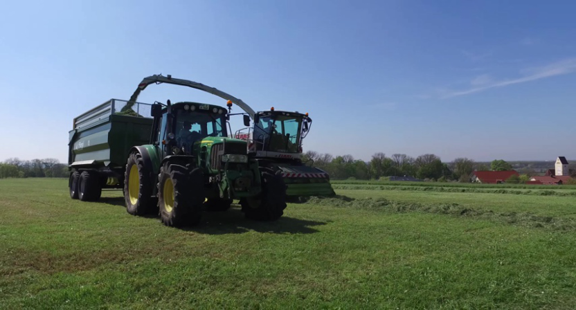
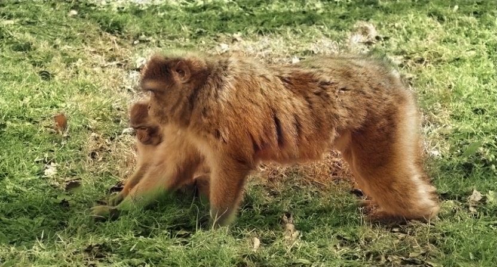
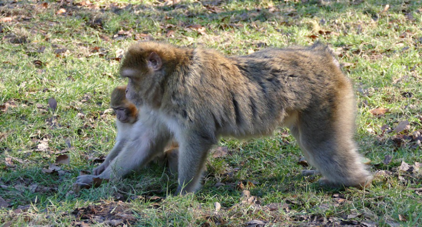
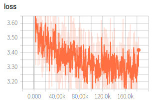
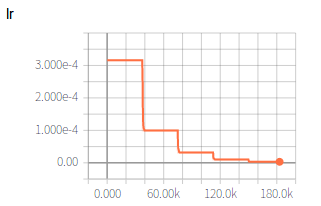

## This repo is the pytorch implementation of [Colorful Image Colorization](https://arxiv.org/abs/1603.08511). In ECCV, 2016.

#### Version info: pytorch 0.3.0, python 3.5

### Installation
git clone https://github.com/chuchienshu/Colorization.git

### Training and validation
training from scratch:
```shell
python main.py 
```
or resume training from specified time point:
```shell
python main.py -R ***
```
Both above commands default to support cross validation, which can be switch down by adding option `-V False.`
More detailed configure setting ,please refer to [config.py](config.py)

### Inference
```shell
python main.py -T False -I ***  # *** means the inference step. 
```

### Results on  DAVIS 2017
<figure class="half">
    
    
</figure>

<figure class="half">
    
    
</figure>

### training loss curve
<figure class="half">
    
    
</figure>

**NOTE:** As you can see,I didnot train enough time(since I do not have NVIDIA's support...).And the initial lr is 3.16e-4, which is 3.16e-5 in original.

### Acknowledgments
Parts of this code were derived, as noted in the code, from [richzhang](https://github.com/richzhang/colorization/tree/master/resources)

### Reference
```markdown
@inproceedings{zhang2016colorful,
  title={Colorful Image Colorization},
  author={Zhang, Richard and Isola, Phillip and Efros, Alexei A},
  booktitle={ECCV},
  year={2016}
}
```

